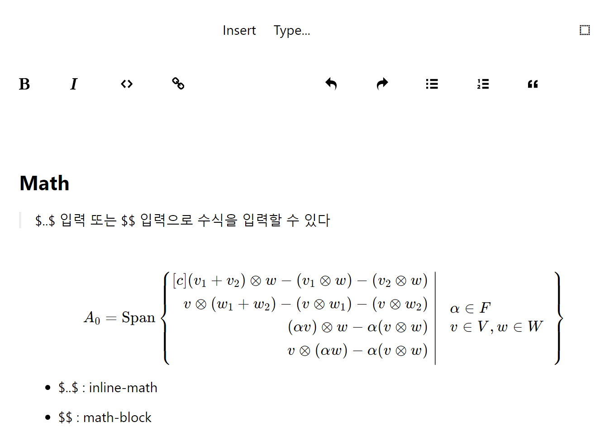

# React ProseMirror Markdown And Math Editor

React ProseMirror Markdown And Math Editor 

> ProseMirror is a useful tool for creating rich text editors in web browsers. I am trying to migrate to the React version.




### install

```
npm install
```

### dev

```
npm run dev
```

### build

```
npm run build
```

## Reference

+ [ProseMirror](https://github.com/ProseMirror) : MIT license
+ [benrbray/prosemirror-math](https://github.com/benrbray/prosemirror-math) : MIT license

> Thanks 